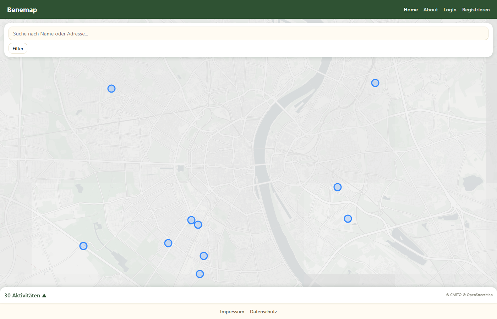
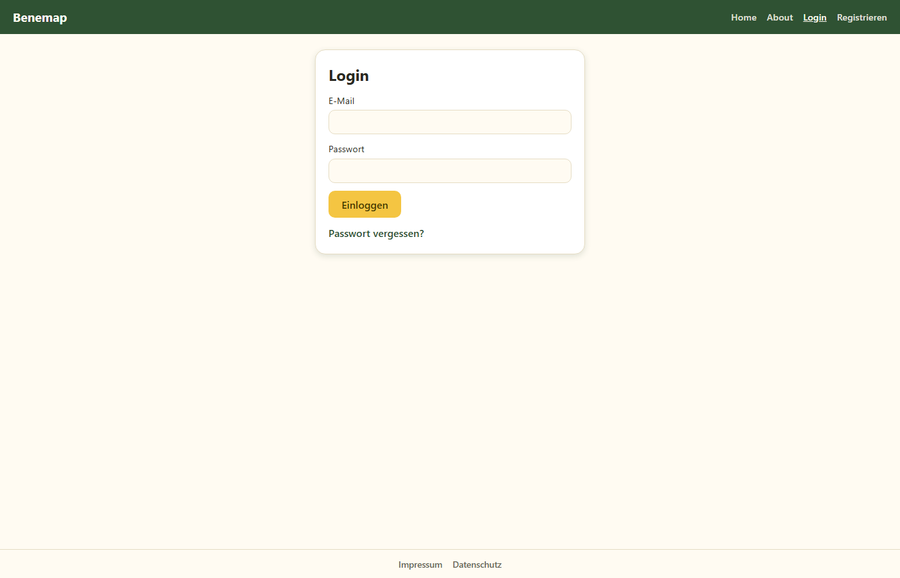

# Benemap — Volunteer Map for Everyone

An interactive map where volunteer organizations publish activities and volunteers find
and join them nearby. Open source, non-commercial.
Check it out on [https://benemap.org/](https://benemap.org/)



## Features

* Interactive map of volunteer activities, with clustering for nearby pins
* Anbieter (organizations) can register, publish activities (one-off or recurring), and
  manage their own listings
* Volunteers can sign up for activities directly in the app ("Ich mache mit")
* Rating system for activities and providers
* Städtische Angebote — scraped, undated listings from Cologne's municipal volunteer
  database, shown alongside app-native activities
* Category filtering, search by name/address, photo galleries
* Account self-service: profile photo/website, password reset via email, full
  self-deletion (GDPR-friendly)



## Project Structure

```
/orga        // organization / documentation / planning files
/frontend    // Svelte 5 frontend (SPA, fetches data from backend)
/backend     // Spring Boot (Kotlin) backend (REST API + H2 database)
```

---

## Tech Stack

* **Frontend**: Svelte 5 + TypeScript + Vite, Leaflet-based map (via `sveaflet`)
* **Backend**: Spring Boot + Kotlin, Spring Security (session auth), Spring Data JPA
* **Database**: H2 (file-based)
* **Mail**: SMTP via Brevo, for password-reset emails

---

## How to Run (Development)

### Backend (Spring Boot)

```bash
cd backend
./gradlew bootRun      # run Spring Boot
```

* Runs on `http://localhost:8080`
* Provides REST endpoints (e.g., `/api/volunteers`)
* Supports **CORS** for frontend development
* Starts with an **empty map** — no data is seeded automatically. To get some pins to
  look at: `./gradlew bootRun --args='--seed-fake'` (30 fake activities) or
  `./gradlew bootRun --args='--scrape'` (real listings scraped from Cologne's municipal
  volunteer database)

### Frontend (Svelte)

```bash
cd frontend
npm install
npm run dev            # runs Svelte dev server
```

* Runs on `http://localhost:5173`
* Fetches data from backend via `/api` endpoints

### Tests

```bash
cd backend && ./gradlew test      # backend test suite
cd frontend && npm run check      # type-check frontend
```

### Production Build

* Build Svelte frontend:

```bash
cd frontend
npm run build
```

* Copy `frontend/dist/` → `backend/src/main/resources/static/`
* Spring Boot will now serve both frontend (`/`) and backend (`/api`) from **one server**

### Notes

* No HTML templates in backend — frontend Svelte SPA handles UI
* Modular frontend allows multiple pages/components
* Works best with JS enabled; Svelte SPA will be blank if JS is blocked

---

## Roadmap / Most important TODOs

Full backlog lives in [`orga/board.md`](orga/board.md). Before a public beta, the
priorities are:

- [ ] **E-Mail-Verifizierung bei Registrierung** — prevents typo'd/fake addresses that
  would otherwise permanently lock users out via password reset
- [ ] **Schritt-für-Schritt-Anleitung für Anbieter** — the target audience (Vereine,
  Vermittlungsstellen) skews older and less app-experienced

## License

AGPLv3 — see [LICENSE](LICENSE). If you run a modified version of Benemap as a
network service, you must make the source of your version available to its users.

## Contributing

See [CONTRIBUTING.md](CONTRIBUTING.md) for how to get set up and submit changes.
